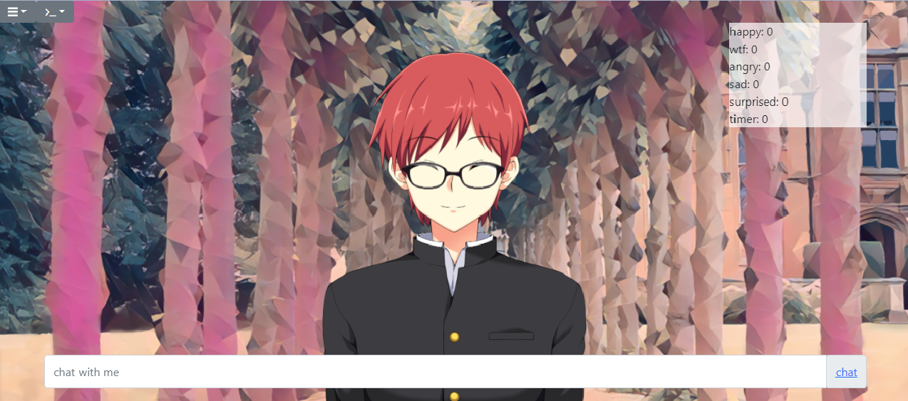

# friday
A chatbot based on visual novel game

## Authors

 **danielcorreaeng** 

## License

This project is licensed under the MIT License - see the [LICENSE](LICENSE) file for details

## Examples

Some examples of bots that can be inserted.

### Original

- Avatar model 001: [sutemo](https://sutemo.itch.io/female-mature-anime-sprite)
- Avatar model 100 and 101: [sutemo](https://sutemo.itch.io/male-character-sprite-for-visual-novel)
- Background model 001: [florassence](https://florassence.itch.io/garden-backgrounds)
- Background model 100 : [fluffness](https://cloudnovel.net/fluffness/background/art-classroom-day-night-etc-1)
- Background model 101 : [fluffness](https://cloudnovel.net/fluffness/background/house-day-night-etc)

## Instalation

It has been tested with Python 3.6.8.

For instalation, you will install the requirements **in path of friday**.

    pip install -r requirements.txt

To run service use:

    python friday.py

Enter in browser address. Like **ip:port\bot**
  
Have fun!!! =)

## Training

For training use in chat input

    [learn] ask [answer] answer

For training with tags - the tag will count and it will not appear in the response

    [learn] ask [answer] answer [feeling tag]

For training with button in answer

    [learn] ask [answer] answer [button] button 1 [button] button 2 [button] button 3 [button] button 4  

    
